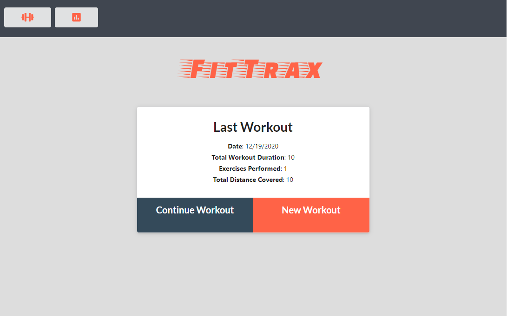
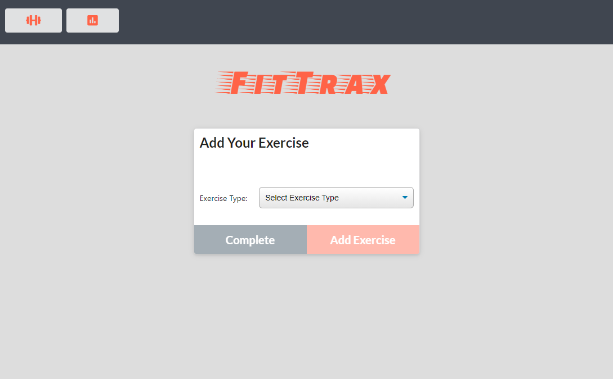
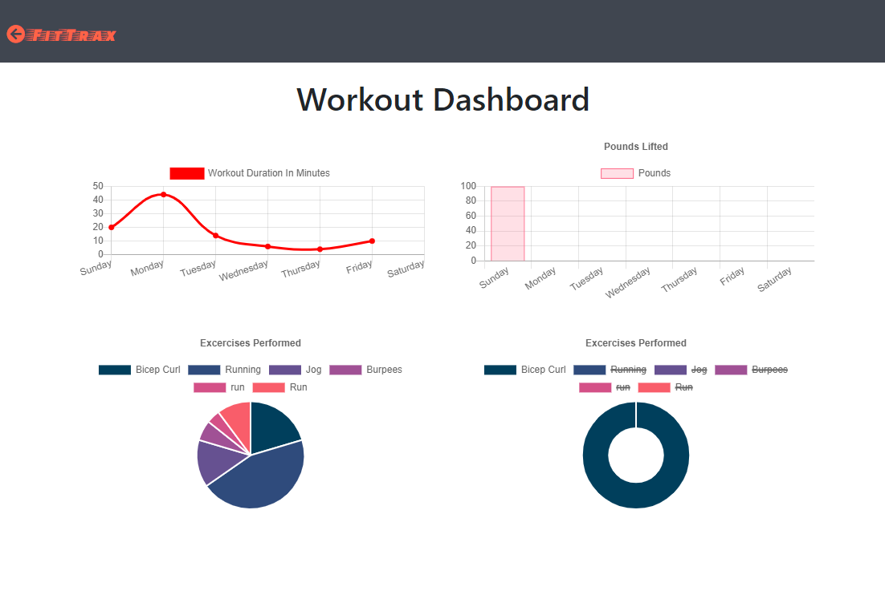

FitTrax is a fitness logger that allows users to track daily workouts. They will be able to log multiple workouts per day. Each workout can consist of multiple excersises.

## Table of Contents

* [Description](#description)
* [Usage](#usage)
* [Screenshots](#screenshots)
* [Questions](#questions)

## Description

* Link to the Heroku deployed application - [FitTrax](https://serene-sierra-26721.herokuapp.com/)
* Simple application powered by [Node.js](https://nodejs.org/en/), [Express](http://expressjs.com/) , [Mongoose.js](https://mongoosejs.com/) , [MongoDB](https://www.mongodb.com/)

## Usage

The site is fairly straightforward. Users can create a `New Workout` or select `Continue Workout`, where they are allowed to input multiple `Exercises` per workout. The exercises can be `Cardio` or `Resistance`. If the user chooses a `Cardio` workout, they will be allowed to track `Exercise Name`, `Distance` travelled (if applicable), and `Duration`. For the `Resistance` exercises, the user will be able to enter in `Exercise Name`, `Weight (lbs)`, `Sets`, `Reps`, and `Duration`. The statistics of the last workout are tallied and presented on the main page. The user can also go to the `Stats` page to see a dashboard of all the workouts and exercises performed over the past week.

## Screenshots

Screenshot of the main page

Screenshot of exercise entry page

Screenshot of the Stats dashboard

## Questions

Feel free to get in touch with me if you have any questions or concerns.

Link to my GitHub Profile: [Bertodemus](https://github.com/bertodemus)

Email me at: [roberto@robertorubet.com](roberto@robertorubet.com)

